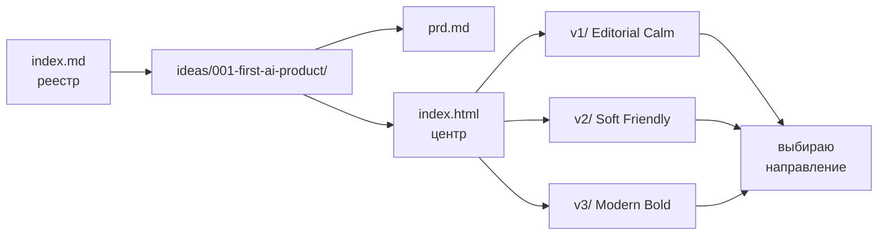

# x26-ideas

> **Карточка отдела**

| | |
|---|---|
| **Статус** | 🟢 активен |
| **Тип** | отдел идей в HTML |
| **Стек** | HTML + Tailwind (CDN), без сборки |
| **Реестр (агент)** | [`index.md`](./index.md) |
| **Правила (агент)** | [`AGENTS.md`](./AGENTS.md) |

---

## Что это

Личный отдел идей: каждая идея — папка с **PRD** (`prd.md`) и **HTML-центром** (`index.html`). Внутри идеи — варианты визуализации (`v1/`, `v2/`, …). Всё рендерится одним HTML-файлом без сборки.

## Как устроено



**Триада идеи:** PRD → центр → варианты.

| слой | файл | роль |
|------|------|------|
| PRD | `prd.md` | аудитория, цель, результат |
| центр | `index.html` | описание идеи + карточки вариантов |
| вариант | `v<N>/index.html` | конкретный лендинг |
| вариант | `v<N>/brief.md` | копия PRD + дизайн-решения версии |

## Текущие идеи

| # | идея | дата | статус | центр |
|---|------|------|--------|-------|
| 001 | Первый продукт с AI | 2026-05-18 | 🟡 варианты | [открыть](ideas/001-first-ai-product/index.html) |

### Варианты идеи 001

| | направление | палитра | тон |
|---|---|---|---|
| [`v1/`](ideas/001-first-ai-product/v1/index.html) | **Editorial Calm** | тёплый off-white + терракота | спокойный, книжный |
| [`v2/`](ideas/001-first-ai-product/v2/index.html) | **Soft Friendly** | пастель: лаванда, мята, роза | тёплый, на «ты» |
| [`v3/`](ideas/001-first-ai-product/v3/index.html) | **Modern Bold** | чёрный + кислотный лайм | уверенный, на «вы» |

## Как запускать

```bash
open ideas/001-first-ai-product/index.html   # центр идеи 001
open ideas/001-first-ai-product/v1/index.html # конкретный вариант
```

## Следующий шаг

По идее 001: выбрать одно направление, отшлифовать копирайт и подключить настоящий Telegram-хэндл вместо плейсхолдера.

## Правила для AI-агентов

См. [`AGENTS.md`](./AGENTS.md) — конвенции, реестр [`index.md`](./index.md), что разрешено / что требует подтверждения.
