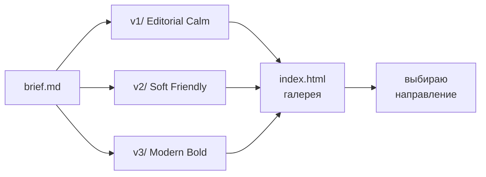

# x26-ideas

> 🗂 **Карточка проекта**

| | |
|---|---|
| **Статус** | 🟡 исследование |
| **Тип** | дизайн-песочница / прототипы лендингов |
| **Стек** | HTML + Tailwind (CDN), без сборки |
| **Текущий бриф** | [`brief.md`](./brief.md) — сайт «Первый продукт с AI» |
| **Галерея** | [`index.html`](./index.html) |

---

## Что это

Личная песочница для быстрых дизайн-итераций. Один бриф → несколько визуальных направлений в отдельных папках → выбираем сильное и доводим.

Всё рендерится одним HTML-файлом без сборки. Tailwind подключается через CDN, кастомных стилей нет. Это даёт скорость: открыл файл в браузере и сразу видишь результат.

## Как устроено



Каждый вариант — папка `v<N>/` с двумя файлами:

- `index.html` — сам лендинг.
- `brief.md` — копия исходного брифа + секция «Дизайн-решения этой версии» внизу. Так бриф остаётся переиспользуемым для следующих проектов.

## Текущие варианты

| | направление | палитра | тон |
|---|---|---|---|
| [`v1/`](./v1/index.html) | **Editorial Calm** | тёплый off-white + терракота | спокойный, книжный |
| [`v2/`](./v2/index.html) | **Soft Friendly** | пастель: лаванда, мята, роза | тёплый, на «ты» |
| [`v3/`](./v3/index.html) | **Modern Bold** | чёрный + кислотный лайм | уверенный, на «вы» |

## Как запускать

```bash
open index.html       # вся галерея
open v1/index.html    # конкретный вариант
```

## Следующий шаг

Выбрать одно направление, отшлифовать копирайт и подключить настоящий Telegram-хэндл вместо плейсхолдера.

## Правила для AI-агентов

См. [`AGENTS.md`](./AGENTS.md) — конвенции по структуре, Tailwind-only, что разрешено / что требует подтверждения / что запрещено.
