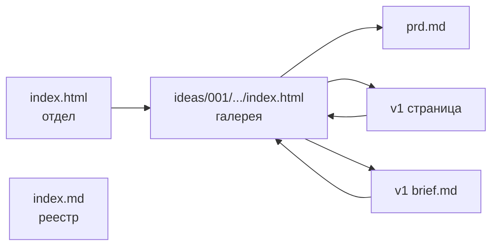

# x26-ideas

> **Карточка отдела**

| | |
|---|---|
| **Статус** | 🟢 активен |
| **Тип** | отдел идей в HTML |
| **Стек** | HTML + Tailwind (CDN), без сборки |
| **Вход (люди)** | [`index.html`](./index.html) · [сайт](https://serejaris.github.io/x26-ideas/) |
| **Реестр (агент)** | [`index.md`](./index.md) |
| **Правила (агент)** | [`AGENTS.md`](./AGENTS.md) |

---

## Что это

Личный отдел идей: каждая идея — папка с **PRD** (`prd.md`) и **HTML-центром** (`index.html`). Внутри идеи — варианты визуализации (`v1/`, `v2/`, …). Всё рендерится одним HTML-файлом без сборки.

## Как устроено



**Триада идеи:** PRD → урок/центр → варианты. Для учебных демо добавляется папка `prompts/`.

| слой | файл | роль |
|------|------|------|
| PRD | `prd.md` | аудитория, цель, результат |
| урок | `index.html` | методический маршрут + карточки вариантов |
| материалы | `prompts/` | копируемые промпты для повторения процесса |
| вариант | `v<N>/index.html` | конкретный лендинг |
| вариант | `v<N>/brief.md` | копия PRD + дизайн-решения версии |

## Навигация

Точка входа — [`index.html`](./index.html) в корне: **галерея трёх версий главной** (`home/v1`–`v3`) + карточка идеи 001. Дальше по цепочке:

1. **Отдел** → галерея идеи + PRD.
2. **Галерея** (`ideas/…/index.html`) — хаб: у каждого варианта две ссылки — **Страница** (лендинг) и **Бриф** (`.md`, можно выделить и скопировать).
3. **Лендинг** (`v<N>/index.html`) — вверху ссылки «Галерея идеи» и «Бриф vN».

Брифы открываются как plain text в браузере (`file://` или GitHub) — Cmd+A, копировать.

### Версии главной (home)

| | направление | открыть |
|---|---|---|
| v1 | **Editorial Calm** | [страница](home/v1/index.html) · [бриф](home/v1/brief.md) |
| v2 | **Soft Friendly** | [страница](home/v2/index.html) · [бриф](home/v2/brief.md) |
| v3 | **Modern Bold** | [страница](home/v3/index.html) · [бриф](home/v3/brief.md) |
| v4 | **Index Shelf** (каталог) | [страница](home/v4/index.html) · [бриф](home/v4/brief.md) |
| v5 | **Spatial Bento** | [страница](home/v5/index.html) · [бриф](home/v5/brief.md) |
| v6 | **D3 Force Graph** | [страница](home/v6/index.html) · [бриф](home/v6/brief.md) |
| v7 | **D3 Tree Explorer** | [страница](home/v7/index.html) · [бриф](home/v7/brief.md) |

## Текущие идеи

| # | идея | дата | статус | центр |
|---|------|------|--------|-------|
| 001 | Первый продукт с AI | 2026-05-18 | 🟢 готово | [открыть](ideas/001-first-ai-product/index.html) |

### Варианты идеи 001

| | направление | палитра | тон |
|---|---|---|---|
| [`v1/`](ideas/001-first-ai-product/v1/index.html) | **Editorial Calm** | тёплый off-white + терракота | спокойный, книжный |
| [`v2/`](ideas/001-first-ai-product/v2/index.html) | **Soft Friendly** | пастель: лаванда, мята, роза | тёплый, на «ты» |
| [`v3/`](ideas/001-first-ai-product/v3/index.html) | **Modern Bold** | чёрный + кислотный лайм | уверенный, на «вы» |

## Как запускать

**Онлайн (после `git push`):** https://serejaris.github.io/x26-ideas/

**Локально:**

```bash
open index.html                                 # отдел: список идей
open ideas/001-first-ai-product/index.html      # галерея идеи 001
open ideas/001-first-ai-product/v1/brief.md     # бриф для копирования
open ideas/001-first-ai-product/v1/index.html   # лендинг v1
```

## GitHub Pages

Сайт публикуется из ветки **`main`**, папка **`/` (корень)** — без сборки.

| что | где |
|-----|-----|
| настройка | репозиторий → **Settings** → **Pages** → Branch: `main`, Folder: `/` |
| главная (галерея) | https://serejaris.github.io/x26-ideas/ |
| главная v1 Editorial | https://serejaris.github.io/x26-ideas/home/v1/ |
| главная v2 Soft | https://serejaris.github.io/x26-ideas/home/v2/ |
| главная v3 Bold | https://serejaris.github.io/x26-ideas/home/v3/ |
| галерея 001 | https://serejaris.github.io/x26-ideas/ideas/001-first-ai-product/ |
| бриф v1 | https://serejaris.github.io/x26-ideas/ideas/001-first-ai-product/v1/brief.md |

Файл [`.nojekyll`](./.nojekyll) в корне отключает Jekyll: HTML и `.md` отдаются как есть, относительные ссылки работают.

После каждого push в `main` сайт обновляется за 1–3 минуты. Первый деплой — дольше.

## Материалы к уроку

- [Урок HTML](ideas/001-first-ai-product/index.html)
- [Папка промптов](ideas/001-first-ai-product/prompts/README.md)
- [Публичный репозиторий](https://github.com/serejaris/x26-ideas)

## Следующий шаг

По идее 001: после урока выбрать одно направление, отшлифовать копирайт и подключить настоящий Telegram-хэндл вместо плейсхолдера.

## Правила для AI-агентов

См. [`AGENTS.md`](./AGENTS.md) — конвенции, реестр [`index.md`](./index.md), что разрешено / что требует подтверждения.
